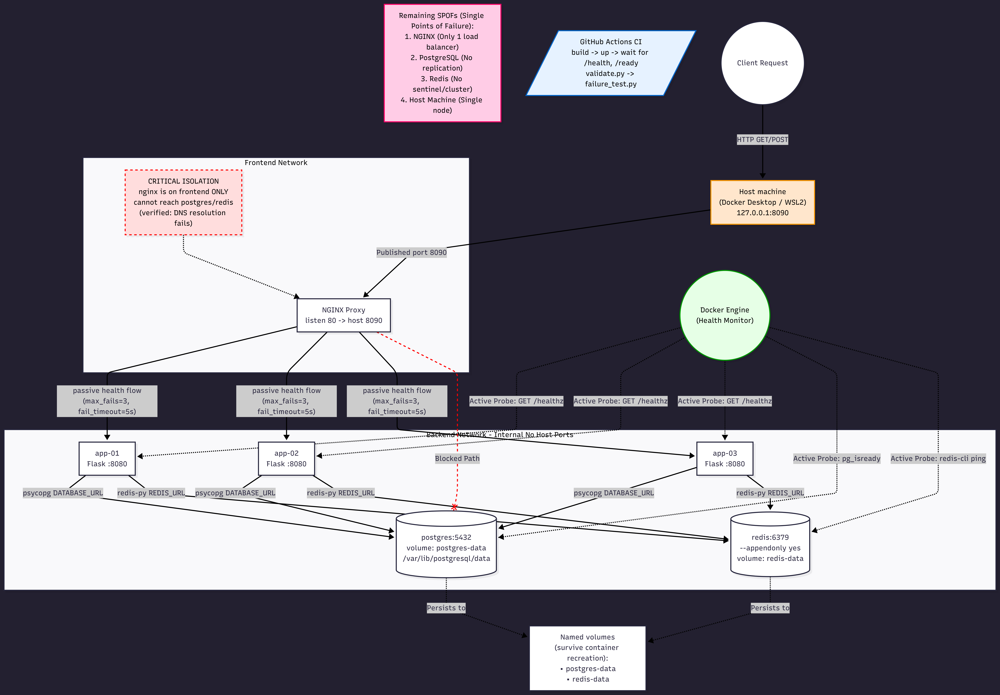

# BARQ Systems DevOps Assessment

## Prerequisites
- Docker and Docker Compose installed
- Linux/WSL environment

## Setup
```bash
cp .env.example .env
docker compose build
```

## Start / Stop
```bash
docker compose up -d
docker compose ps          # verify all services are healthy
docker compose stop        # stop without deleting data
```

## Test Endpoints
```bash
curl http://127.0.0.1:8090/
curl http://127.0.0.1:8090/health
curl http://127.0.0.1:8090/ready
curl http://127.0.0.1:8090/records
curl http://127.0.0.1:8090/counter
curl http://127.0.0.1:8090/instance
```

## Run Validation
```bash
chmod +x validate.py failure_test.py
./validate.py
./failure_test.py
```

## Backup and Restore
```bash
chmod +x backup.sh restore.sh
./backup.sh
./restore.sh
```

## Cleanup
```bash
docker compose down -v
```
